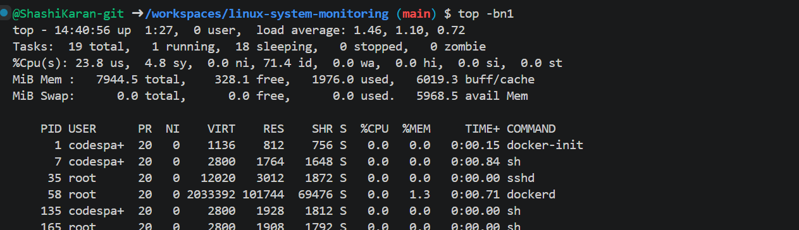
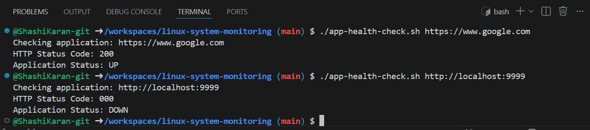

# Linux System Monitoring

## Overview

This repository contains two Bash scripts developed as part of the AccuKnox DevOps Assessment.

### Objectives Completed

- System Health Monitoring Script
- Application Health Checker

## Technologies Used

- Bash
- Linux
- GitHub Codespaces
- curl
- bc

## Scripts

### 1. system-health.sh

Monitors:

- CPU Usage
- Memory Usage
- Disk Usage
- Running Processes

Displays alerts when usage exceeds predefined thresholds.

Run:

```bash
./system-health.sh
```

---

### 2. app-health-check.sh

Checks whether an application is UP or DOWN by verifying the HTTP status code.

Run:

```bash
./app-health-check.sh https://www.google.com
```

---

## Screenshots

### System Health Monitoring



### Application Health Checker



---

## Author

Shashi Karan